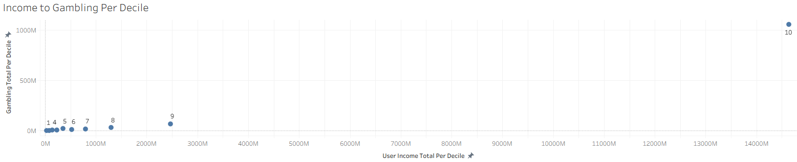
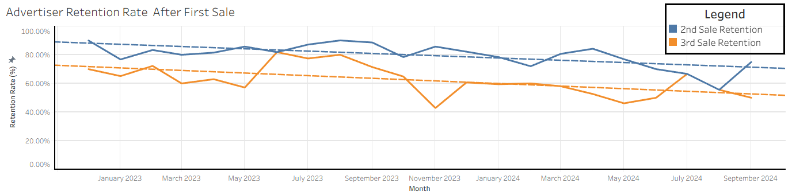
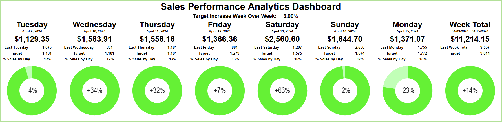

# Hi, I'm Lukas Ishihara, a graduating Business Analyst with experience in SQL, data analysis, and turning data into business decisions. My portfolio projects are from my role as Business Analyst (Founder) at The Collective.  

Currently seeking internship and entry-level analyst roles.
  
-----------------------------------------------------------  
## Featured Presentations:

1) [Reversing a Declining Department](https://github.com/Lukas-Ishihara/Reversing-a-Declining-Department/blob/main/Lukas_Ishihara_Reversing_a_Declining_Department.pdf)

2) [Analyzing Advertiser Retention](https://github.com/Lukas-Ishihara/Analyzing-Advertiser-Retention-After-First-Sale/blob/main/Lukas_Ishihara_Advertiser_Retention_Analysis.pdf)

3) [Sales Performance Analytics Dashboard](https://github.com/Lukas-Ishihara/Sales-Performance-Analytics-Dashboard/blob/main/Lukas_Ishihara_Sales_Performance_Analytics_Dashboard.pdf)

  
------------------------------------------------------------  
Tools: PostgreSQL · SQLite · Google Sheets · Tableau · Excel  
Contact: lukas.ishihara@gmail.com
