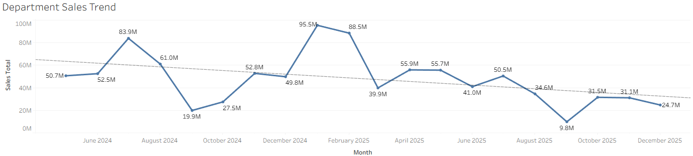
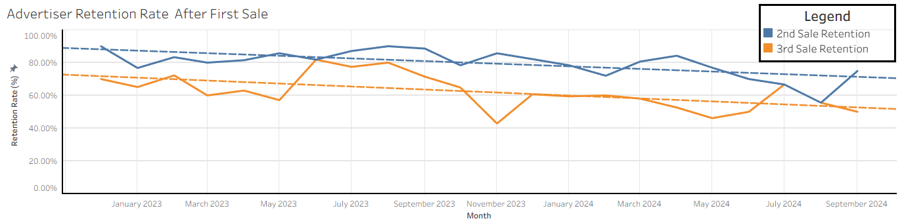
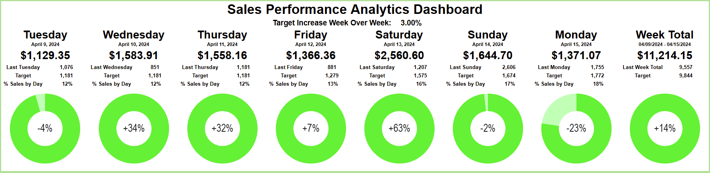

Hi, I'm Lukas Ishihara, a graduating Business Analyst with experience in SQL, data analysis, and turning data into business decisions. My portfolio projects are from my role as a Business Analyst at The Collective.  

Currently seeking entry-level analyst roles.

---
Tools: PostgreSQL · SQLite · Google Sheets · Tableau · Excel  

Email: lukas.ishihara@gmail.com  
Linkedin: [https://www.linkedin.com/in/lukas-ishihara](https://www.linkedin.com/in/lukas-ishihara/)
  
---  
## Featured Presentations:

## 1) [Reversing a Declining Department](https://github.com/Lukas-Ishihara/Reversing-a-Declining-Department/blob/main/Lukas_Ishihara_Reversing_a_Declining_Department.pdf) - 8 Slides

## 2) [Analyzing Advertiser Retention](https://github.com/Lukas-Ishihara/Analyzing-Advertiser-Retention-After-First-Sale/blob/main/Lukas_Ishihara_Advertiser_Retention_Analysis.pdf) - 7 Slides

## 3) [Sales Performance Analytics Dashboard](https://github.com/Lukas-Ishihara/Sales-Performance-Analytics-Dashboard/blob/main/Lukas_Ishihara_Sales_Performance_Analytics_Dashboard.pdf) - 7 Slides

If you made it this far down the page, thanks! Here is a mnemonic for my name:  
A restroom and a kiss  
An eye test that some will miss
